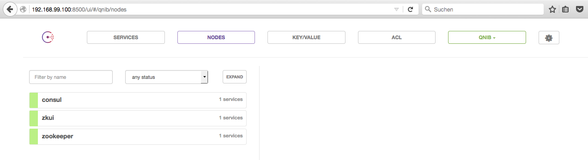
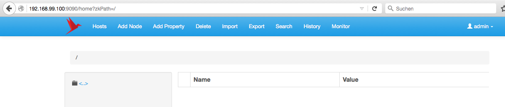

# docker-zkui
[](https://imagelayers.io/?images=qnib/zkui:latest 'Get your own badge on imagelayers.io')

Zookeeper UI which connects automatically to `leader.zookeeper.service.consul,follower.*`.

The login credentials are `admin/manager`.

## Autostart=false

The service `zkui` is by default disable and waits for a `zookeeper` service to pop up in consul. This behavior can be changed by using the environment variable `SUPERVISOR_AUTOSTART_SRV`:

```
SUPERVISOR_AUTOSTART_SRV=zkui
```

By doing so, the zkui service should start. Haven't verified it yet.... 

## Compose File

To run the stack in a consul environment just spawn the compose file.

```
$ docker-compose up -d
Creating dockerzkui_consul_1
Creating dockerzkui_zkui_1
Creating dockerzkui_zookeeper_1
$
```
After a bit all services should be green within Consul `<docker-host>:8500`.



## ZKUI

After the services are up'n'running just head over to the WebUI `<docker-host>:9090`. The login is `admin/manager`.




